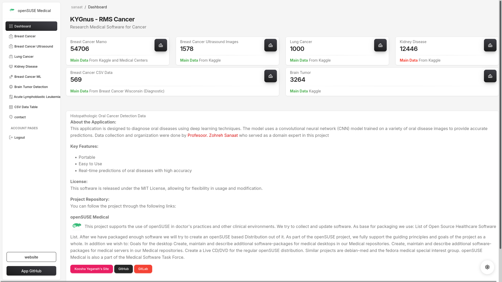

# 🏥 **RMS - Cancer**

### An AI-Powered Desktop Solution for Cancer and Disease Detection  
> _Detect Breast Cancer, Lung Cancer, Kidney Diseases, Brain Tumors, and more with advanced deep learning and machine learning techniques._

---



---

## **Overview**

The **Health Diagnostic Application** is an advanced, AI-driven desktop tool designed to assist in diagnosing multiple diseases, including:
- 🧠 **Brain Tumor Detection** (Using Deep Learning with MONAI)
- 🫁 **Lung Cancer Prediction** (Deep Learning Monai)
- 🦷 **Kidney Disease Diagnosis** (Including Tumor and Stones with Deep Learning Monai)
- 🎀 **Breast Cancer Detection with mamography** (Deep Learning Monai)
- 🎀 **Breast Cancer Detection with Ultrasonography** (Deep Learning Monai)
- 🎀 **Breast Cancer Detection** (Machine Learning with scikit-learn)

Developed with Kivy for cross-platform compatibility, this app provides a user-friendly interface that integrates deep learning and machine learning models for disease diagnosis and detection.

---

## **Key Features**

- **Deep Learning-Based Diagnosis**: Detect brain tumors using MONAI and other advanced deep learning models.
- **Machine Learning Predictions**: Identify risk and probability of lung and breast cancer.
- **Kidney Disease Analysis**: Diagnose kidney issues such as tumors and stones.
- **Cross-Platform GUI**: Built with Kivy, compatible with all major desktop platforms (Windows, macOS, Linux).
- **Comprehensive and Accurate**: Uses state-of-the-art models and trained datasets to ensure high accuracy.

---

## **Technologies Used**

| Technology          | Purpose                              |
|---------------------|--------------------------------------|
| **Kivy**            | Cross-platform GUI development      |
| **MONAI**           | Deep learning for medical imaging   |
| **scikit-learn**    | Machine learning for cancer detection|
| **NumPy**           | Data manipulation                   |
| **pandas**          | Data handling and preprocessing     |

---

## **Installation Instructions**

To install and run the application, ensure you have Python 3.8+ installed. Follow these steps:

1. **Clone the Repository**  
    ```bash
    git clone https://github.com/KooshaYeganeh/rms-cancer.git
    ```

2. **Install Required Packages**  
    ```bash
    pip install -r requirements.txt
    ```

3. **Run the Application**  
    ```bash
    python app.py
    ```

---

## **How to Generate an Executable File with PyInstaller**

To create an executable file for easy distribution:

1. Ensure that `pyinstaller` is installed:
    ```bash
    pip install pyinstaller
    ```

2. Run the following command to create the executable:
    ```bash
    pyinstaller rms_cancer_desktop.linux.spec
    ```

   This will generate a standalone executable in the `dist` folder that can be shared and run on compatible systems.

---

## **Usage Guide**

### 1. **Load Medical Data**
   - Upload relevant medical images or data files as required by the diagnosis model (e.g., CT scans for brain tumors).

### 2. **Choose Diagnostic Mode**
   - Select the type of diagnosis: **Brain Tumor**, **Lung Cancer**, **Kidney Disease**, or **Breast Cancer**.

### 3. **View Prediction Results**
   - The application will analyze the input and provide a diagnosis prediction, indicating potential risk levels.

---


## **Model Information**

### 1. **Brain Tumor Detection**
   - Uses **MONAI** for deep learning and medical image processing, focusing on accurate identification of tumor regions.

### 2. **Breast Cancer Detection**
   - Machine learning model with **scikit-learn**, trained on breast cancer datasets to predict and classify cancer stages.

### 3. **Lung Cancer Prediction**
   - Utilizes structured data for predicting lung cancer presence and probability based on several input features.

### 4. **Kidney Disease Diagnosis**
   - Identifies kidney-related issues, including tumors and stones, based on medical imaging data.

---

## **System Requirements**

- **Operating System**: Windows, macOS, Linux
- **Python Version**: 3.8 or higher
- **Dependencies**: See `requirements.txt`

---

## **Folder Structure**

```
rms-cancer/

├── app.py
├── csv_train.py
├── leukemia_train.py
├── LICENSE
├── README.md
├── requirements.txt
├── screenshots
├── static
├── templates
├── train_test_split.py
├── uploads
└── venv


```
---

## **Contributors**

- **koosha yeganeh** - Initial development and deep learning model integration
- **professor Zohreh Sanaat** - Specialist in Medical Oncology and Hematology

Thank you to all contributors for their dedication and support in developing this project!

---

## **Developers and Maintainers**

- **Lead Developer**: Koosha Yeganeh
    - **Email**: kooshakooshadv@gmail.com
    - **GitHub**: [GitHub Profile](https://github.com/KooshaYeganeh)

- **Project Maintainer**: Your Organization
    - **Contact**: kooshakooshadv@gmail.com

If you are interested in contributing to this project, please refer to the [CONTRIBUTING.md](CONTRIBUTING.md) file for guidelines.

---

## **License**

This project is licensed under the MIT License. See the [LICENSE](LICENSE) file for details.

---

## **Contact**

For any questions or support, please contact us:
- **Email**: kooshakooshadv@gmail.com
- **GitHub**: Submit a ticket [here](https://github.com/KooshaYeganeh/rms-cancer).

--- 

## **Acknowledgments**

Special thanks to the open-source libraries and datasets that have enabled the creation of this application, including **MONAI**, **scikit-learn**, and the open medical imaging datasets.

## Reources

- Breast Cancar CSV : Breast Cancer Wisconsin (Diagnostic) Data Set
- Mamo Data : Kaggle : https://www.kaggle.com/datasets/gauravduttakiit/mammography-breast-cancer-detection

